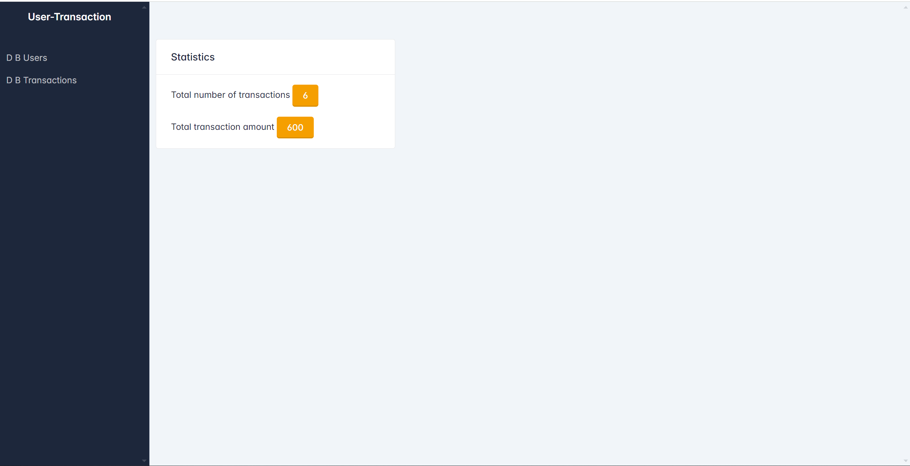

<h1 align="center">🔁 User-Transaction 🔁</h1>
<h3 align="center">Microservice for managing users and their transactions</h3>
<h3 align="center">Based on Starlette and FastAPI</h3>

## 📝 Description

Managing data from “users” tables and “transaction” tables

### ✅ Implemented checks

* 4 endpoint APIs (add_user, get_all_users, get_user,
  add_transactions) 
* Admin Panel (with CRUD operations)
  
  
* statistics window (information about the total number of transactions and the total amount of all
  transactions) 

## 🛢️Technology stack

* Backend: Python 3.12.4, FastAPI 0.111.0, Starlette 0.37.2, SQLite
* Admin panel: Starlette-admin 0.14.0
* Frontend: HTML
* Virtual Environment: venv
* Database Migrations: Alembic 1.13.2
* Dependency Management: pip
* Collaboration and Version Control: Git, GitHub

## 🔀 Structure description

* the root app is available at: [http://localhost:8000](http://localhost:8000)
* GET `/admin/` -- Starlette admin panel
* POST `/docs/` -- API documentation on SwaggerUI
    * POST `/users/` -- add user (accepts a username, returns the ID of the created user)
    * GET `/users/` -- get all users (returns all users and all transactions of each user)
    * GET `/users/{user_id}/` -- get user (accepts user_id, returns id, username, and all user transactions)
    * POST `/transactions/` -- add transactions (accepts user_id, returns transaction type, amount)

## 🚀 Install using GitHub

1. Install Python
1. Clone the repo
   ```commandline
   https://github.com/OleksiiKiva/user_transaction.git   
   ```
1. Open the project folder in your IDE
1. Open the project terminal folder. Create & activate venv
   ```commandline
   python -m venv venv
   venv\Scripts\activate (on Windows)
   source venv/bin/activate (on Linux/MacOS)
   ```
1. Install all requirements
   ```commandline
   pip install -r requirements.txt
   ```
1. Apply migrations & update the database schema
   ```commandline
   alembic upgrade head
   ```
1. Start development server
   ```commandline
   python -m uvicorn main:app --reload
   ```

## 📧 Contacts

Please send bug reports and suggestions by email:
[oleksii.kiva@gmail.com](mailto:oleksii.kiva@gmail.com)


